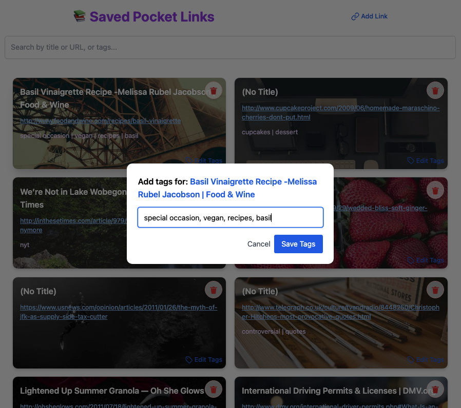

# React + Vite

This template provides a minimal setup to get React working in Vite with HMR and some ESLint rules.

Currently, two official plugins are available:

- [@vitejs/plugin-react](https://github.com/vitejs/vite-plugin-react/blob/main/packages/plugin-react) uses [Babel](https://babeljs.io/) for Fast Refresh
- [@vitejs/plugin-react-swc](https://github.com/vitejs/vite-plugin-react/blob/main/packages/plugin-react-swc) uses [SWC](https://swc.rs/) for Fast Refresh

## Expanding the ESLint configuration

If you are developing a production application, we recommend using TypeScript with type-aware lint rules enabled. Check out the [TS template](https://github.com/vitejs/vite/tree/main/packages/create-vite/template-react-ts) for information on how to integrate TypeScript and [`typescript-eslint`](https://typescript-eslint.io) in your project.

<p style="text-align: center; width: 100%;">
     
</p>


## Pocket Link Saves 📚


This app was mostly "vibe coded" using ChatGPT. Dependencies include: 
* react-router-dom for client side routing
* lucide-react for icons (tag and link icons)
* tailwind, postcss and autoprefixer for most css styles
* json-server to mock a lightweight JSON backend API

The user can view (or visit) their saved links, add a link, add/edit/remove tags on existing links, and delete links. To use this application: 
* fork and clone the Github repo
* in the terminal (root of the application), type `npm install` to install node modules from the package.json
* type `npm run server` to start the json-server
* in a separate terminal, type `npm run dev` to start the react server on port 5173

* if the user wants to clean their database to update ids to be incremental and starting from 1, and to ensure that each item in the db has a tags array, just run `node clean-db.js`

* if the user wants to import their own links from a csv file, there is a script to handle this. Simply drop the csv values into `your-file.csv` From the root of the application run `node fresh-db.js`. This will populate a new file called new-db.json, instead of overwriting the existing db file. The in line 8 of package.json replace this: ```"server": "json-server --watch db.json --port 4000"```, with this: ```"server": "json-server --watch new-db.json --port 4000"```

#### Note that current db object looks like this. The clean-db script is built to ensure these keys exist so the app doesn't break. (And yes, this recipe is very very good.) Please don't hesitate to reach out to me if you have any questions or suggestions for improvements.
```
{
    "id": "925",
    "title": "Pumpkin Pancakes",
    "url": "https://cookieandkate.com/pumpkin-pancakes-recipe/",
    "tags": []
},
